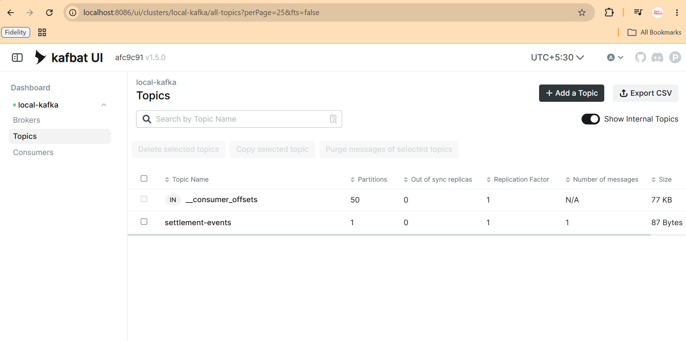
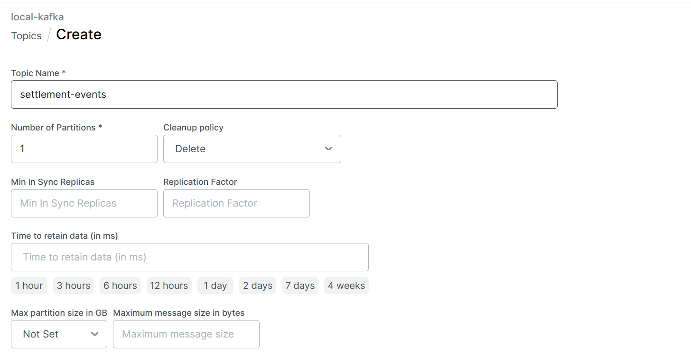
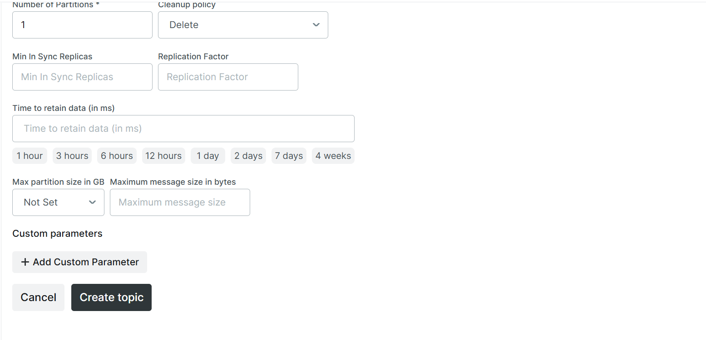
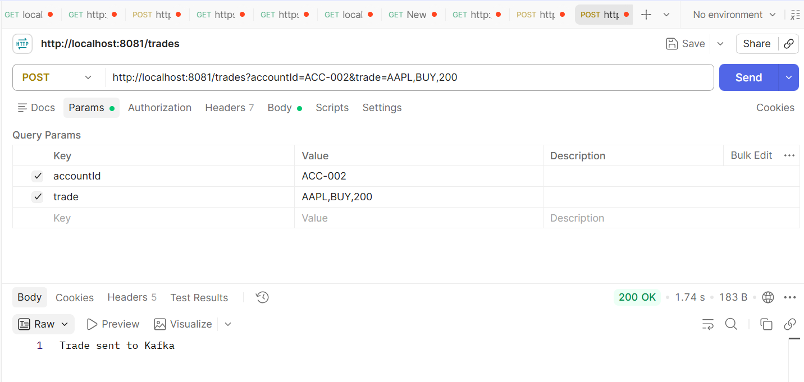
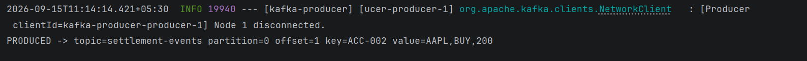
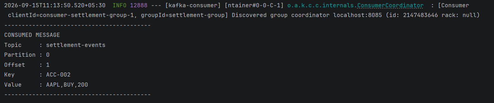

# Spring Boot Kafka Producer + Consumer — Module 5

Two separate Spring Boot applications:

- kafka-producer: REST API -> Kafka
- kafka-consumer: Kafka -> @KafkaListener

## 1. Start Kafka

open ```docker-compose.yml``` file and change localhost to You LINUX IP
Change:
```
KAFKA_ADVERTISED_LISTENERS: HOST://localhost:8085,DOCKER://kafka:29092
```
to:
```
KAFKA_ADVERTISED_LISTENERS: HOST://LINUX_IP:8085,DOCKER://kafka:29092
```

```
docker-compose up --build -d
```

## 2. Create the Module 5 topic

open: 
```
LINUX_IP:8086/
```


- click
```
+ add Topic
```
- Give the name of the topic
```
settlement-events
```


Keep Default Setting

Click
```
Create Topic
```

Verify in LINUX

```
docker exec kafka-sprint7 /opt/kafka/bin/kafka-topics.sh --describe --topic settlement-events --bootstrap-server localhost:8085
```

## 3. Start Producer FIRST
Producer port: 8081

change the localhost to your linux ip in ```application.properties``` file
change
```
spring.kafka.bootstrap-servers=localhost:8085
```
to:
```
spring.kafka.bootstrap-servers=linux_ip_address:8085
```

Start The ```kafka-producer```

## 4. Start Consumer

Producer port: 8082
change the localhost to your linux ip in ```application.properties``` file
change
```
spring.kafka.bootstrap-servers=localhost:8085
```
to:
```
spring.kafka.bootstrap-servers=linux_ip_address:8085
```

Start The ```kafka-consumer```

## 5. Send a trade
Open Postmen/ Bruno

Method:
```
POST 
```
URL:
```
http://localhost:8081/trades?accountId=ACC-001&trade=AAPL,BUY,100
```

### check the console of kafka-producer


### check the console of kafka-consumer




## 6. Demonstrate ordering

```
POST "http://localhost:8081/trades?accountId=ACC-001&trade=AAPL,BUY,100"
```
```
POST "http://localhost:8081/trades?accountId=ACC-001&trade=AAPL,SELL,40"
```
```
POST "http://localhost:8081/trades?accountId=ACC-001&trade=AAPL,BUY,100"
```

All ACC-001 messages should use the same partition and increasing offsets.
